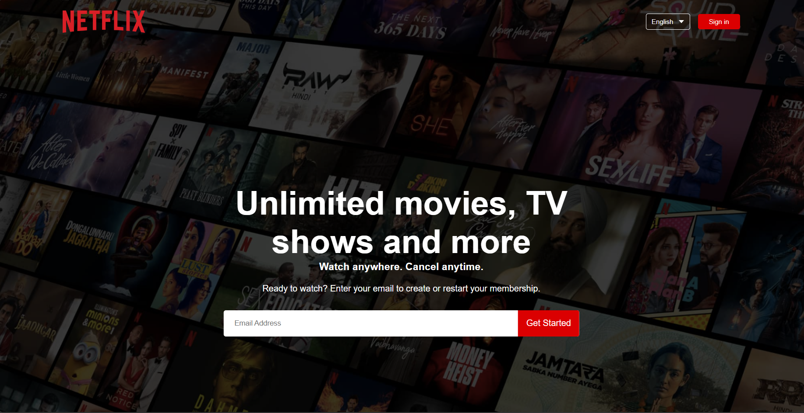

# Netflix Clone

This is a static Netflix clone created using only HTML and CSS. The project aims to replicate the look and feel of the Netflix homepage as closely as possible.

## Table of Contents

- [Demo](#demo)
- [Features](#features)
- [Technologies Used](#technologies-used)
- [Installation](#installation)
- [Usage](#usage)
- [Contributing](#contributing)
- [License](#license)

## Demo


## Features

- Fully responsive design
- Exact clone of Netflix homepage layout
- Custom fonts and icons to match Netflix's style
- Hover effects on movie thumbnails

## Technologies Used

- HTML5
- CSS3

## Installation

To run this project locally, follow these steps:

1. Clone the repository:
    ```bash
    git clone https://github.com/your-username/netflix-clone.git
    ```
2. Navigate to the project directory:
    ```bash
    cd netflix-clone
    ```

## Usage

Open the `index.html` file in your web browser to view the Netflix clone.

## Contributing

Contributions are welcome! Please feel free to submit a Pull Request.

## License

#screenshot


This project is licensed under the MIT License. See the [LICENSE](LICENSE) file for details.
